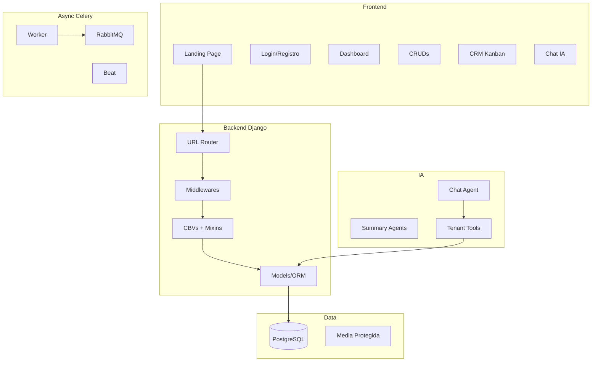

# Arquitetura

## Visão de Camadas

## Princípios

- **Monolito modular Django** — apps coesas por responsabilidade
- **Thin views, fat services** — lógica em `services.py`
- **Tenant em primeiro lugar** — `TenantMiddleware` resolve `request.tenant`
- **Assíncrono por padrão** — Celery para tarefas pesadas
