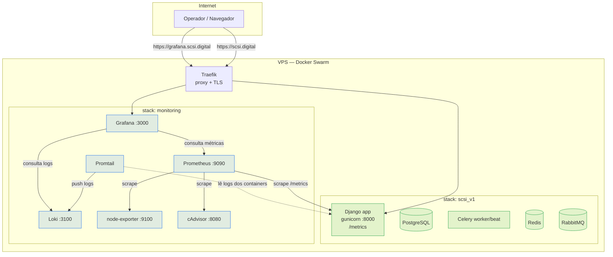
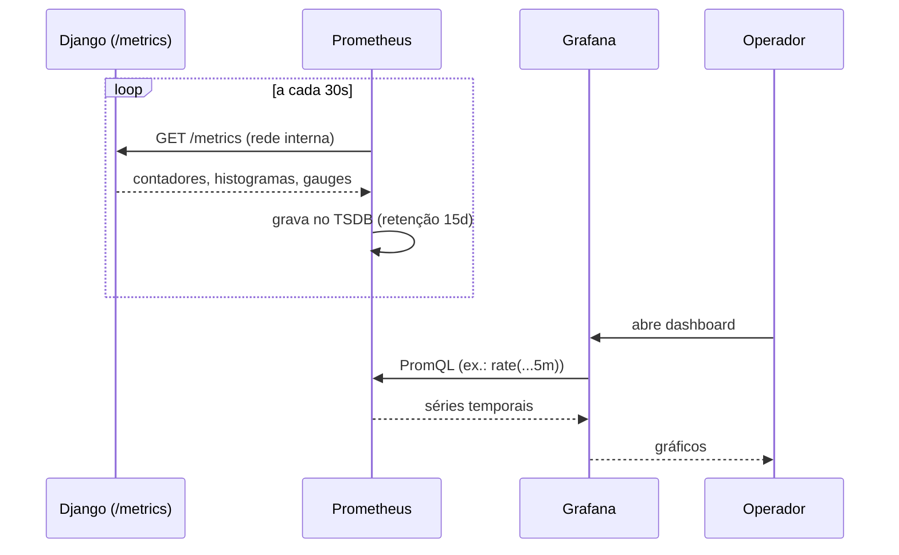
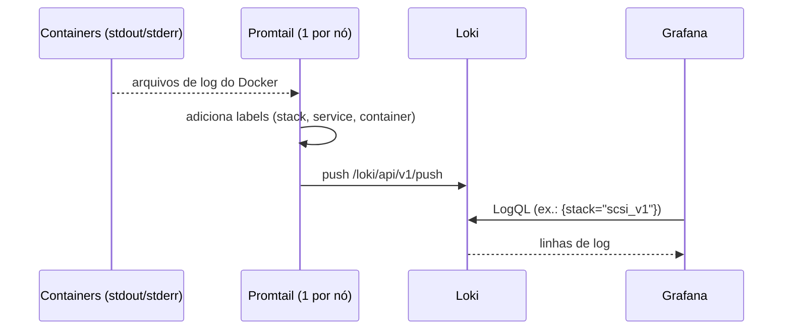
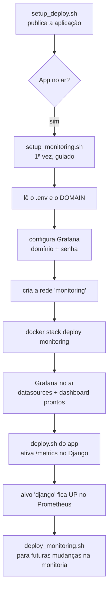

# Monitoramento, Observabilidade e Logs

Este guia documenta **tudo** que foi implementado para dar visibilidade à
aplicação SCSI em produção: o que sobe, por que sobe, como as peças conversam,
os fluxos de uso e como operar no dia a dia.

A stack de monitoramento é **opcional e totalmente separada** da aplicação. Ela
roda em uma stack Swarm própria (`monitoring`), pode ser publicada **depois** do
deploy do sistema e **não interfere** no que já está no ar.

---

## 1. Visão geral

Observabilidade se apoia em três pilares. A stack cobre os três:

| Pilar | Pergunta que responde | Ferramenta |
|-------|-----------------------|------------|
| **Métricas** | Quanto? Quão rápido? Com que frequência? | Prometheus + exporters |
| **Logs** | O que aconteceu, em que ordem, com que contexto? | Loki + Promtail |
| **Visualização** | Como eu vejo tudo isso junto? | Grafana |

### Componentes

| Serviço | Imagem | Função | Modo no Swarm |
|---------|--------|--------|---------------|
| **Prometheus** | `prom/prometheus` | Coleta e armazena métricas (TSDB) | 1 réplica (manager) |
| **Grafana** | `grafana/grafana` | Dashboards e visualização (via Traefik) | 1 réplica (manager) |
| **Loki** | `grafana/loki` | Banco de logs (agregação) | 1 réplica (manager) |
| **Promtail** | `grafana/promtail` | Lê os logs dos containers e envia ao Loki | global (1 por nó) |
| **node-exporter** | `prom/node-exporter` | Métricas do host (CPU, RAM, disco, rede) | global (1 por nó) |
| **cAdvisor** | `cadvisor` | Métricas por container | global (1 por nó) |

Do lado do Django, a biblioteca **`django-prometheus`** instrumenta o app e
expõe um endpoint `/metrics` que o Prometheus coleta.

---

## 2. Arquitetura



### Redes (overlay)

```mermaid
flowchart LR
    subgraph traefik_public[rede: traefik_public]
        T[Traefik]
        A[scsi_v1_app]
        G[monitoring_grafana]
        P[monitoring_prometheus]
    end
    subgraph monitoring[rede: monitoring]
        P2[prometheus]
        G2[grafana]
        L[loki]
        PT[promtail]
        N[node-exporter]
        C[cadvisor]
    end
    P -. coleta tasks.scsi_v1_app:8000 .-> A
    T --> G
```

Duas redes overlay conectam tudo:

- **`traefik_public`** (já existe, criada no deploy do app): permite que o
  Traefik publique o Grafana **e** que o Prometheus alcance o `/metrics` do app
  (ambos estão nessa rede). É o ponto de contato controlado entre as duas stacks.
- **`monitoring`** (criada pelos scripts de monitoria): rede privada onde
  Prometheus, Grafana, Loki, Promtail, node-exporter e cAdvisor conversam.

!!! note "Por que o `/metrics` não fica exposto na internet"
    O endpoint `/metrics` do Django **não** é roteado pelo Traefik. O Prometheus
    o acessa **internamente** pela rede `traefik_public` via DNS do Swarm
    (`tasks.scsi_v1_app:8000`). De fora, `https://scsi.digital/metrics` não é
    publicado por nenhuma regra do Traefik.

---

## 3. Como as métricas chegam ao Grafana (fluxo de métricas)



**Descoberta de alvos (service discovery).** O Prometheus usa DNS interno do
Swarm. `tasks.<serviço>` resolve para os IPs de **todas** as réplicas daquele
serviço (registros A). Assim, ao escalar o app para N réplicas, o Prometheus
passa a coletar as N automaticamente — sem editar config.

Configurado em `monitoring/prometheus/prometheus.yml`:

```yaml
- job_name: "django"
  metrics_path: "/metrics"
  dns_sd_configs:
    - names: ["tasks.scsi_v1_app"]
      type: A
      port: 8000
```

O que o `django-prometheus` entrega de graça: histograma de latência por
view/método, contadores de requests por status/método, métricas de queries e
conexões do banco, cache, migrations e modelos. Os nomes **não** têm prefixo de
namespace — o `django-prometheus` publica as métricas como `django_http_...`,
ex.: `django_http_requests_latency_seconds_by_view_method_bucket`.

---

## 4. Como os logs chegam ao Grafana (fluxo de logs)



O Promtail descobre os containers pelo socket do Docker e lê o que cada um
escreve em **stdout/stderr** (o jeito idiomático em containers — o Django já
loga no console). Ele enriquece cada linha com labels úteis e envia ao Loki:

- `stack` — ex.: `scsi_v1`, `monitoring`
- `service` — ex.: `scsi_v1_app`, `scsi_v1_celery_worker`
- `container`, `logstream` (stdout/stderr)

No Grafana (Explore → Loki) você filtra, por exemplo:

```logql
{stack="scsi_v1", service="scsi_v1_app"} |= "ERROR"
```

!!! tip "Nenhuma mudança de código para logar"
    Como o Promtail coleta o **stdout** dos containers, qualquer `print`/`logger`
    que já vai para o console é capturado automaticamente. O `LOGGING` do
    `core/settings.py` já usa `StreamHandler` (console) — logo, está pronto.

---

## 5. O que foi implementado (passo a passo)

### 5.1 Instrumentação do Django (`core/settings.py`)

Bloco **guardado por import** no fim do arquivo: a instrumentação só liga se a
lib `django_prometheus` estiver instalada. Sem ela, vira um *no-op* — o app sobe
normalmente. **É isso que garante que adicionar monitoria não quebra o deploy
existente.**

```python
try:
    import django_prometheus  # noqa: F401
    PROMETHEUS_ENABLED = True
except ImportError:
    PROMETHEUS_ENABLED = False

if PROMETHEUS_ENABLED:
    INSTALLED_APPS += ['django_prometheus']
    MIDDLEWARE = (['...PrometheusBeforeMiddleware'] + MIDDLEWARE + ['...PrometheusAfterMiddleware'])
    # engine do banco trocada pela versão instrumentada
```

- `PrometheusBeforeMiddleware` precisa ser o **primeiro** e `PrometheusAfter…`
  o **último** — assim medem o tempo total da request, incluindo os demais
  middlewares.
- A **engine do banco** é trocada pela versão instrumentada do django-prometheus
  (mesma semântica, com métricas de query).

### 5.2 Endpoint `/metrics` (`core/urls.py`)

```python
if getattr(settings, 'PROMETHEUS_ENABLED', False):
    urlpatterns += [path('', include('django_prometheus.urls'))]
```

Só registra a rota quando a instrumentação está ativa.

### 5.3 Dependências (`requirements.txt`)

```
django-prometheus @ git+https://github.com/django-commons/django-prometheus.git@77a983e676ab85d2419ae4612852bf08837526e2
prometheus-client==0.24.1
```

Usamos o fork `django-commons` por compatibilidade com **Django 6** (o release
do PyPI ainda não cobre).

### 5.4 Arquivos da stack de monitoria

```
monitoring-stack.yml                      # a stack (genérica, lê variáveis do .env)
monitoring/
├── prometheus/
│   ├── prometheus.yml                     # alvos de scrape (1 valor do projeto)
│   └── alert_rules.yml                    # alertas (infra + app)
├── loki/
│   └── loki-config.yml                    # Loki single-binary + retenção
├── promtail/
│   └── promtail-config.yml                # descoberta de containers + labels
└── grafana/
    ├── provisioning/
    │   ├── datasources/datasources.yml    # Prometheus + Loki conectados
    │   └── dashboards/dashboards.yml      # auto-import de dashboards
    └── dashboards/
        └── scsi-overview.json             # dashboard pronto (app + infra + logs)
```

### 5.5 Scripts

| Script | Papel | Equivalente do app |
|--------|-------|--------------------|
| `scripts/setup_monitoring.sh` | Guia **passo a passo** para subir a monitoria (1ª vez) | `setup_deploy.sh` |
| `scripts/deploy_monitoring.sh` | Refaz o deploy da monitoria (reconcile / `--clean`) | `deploy.sh` |

### 5.6 Variáveis no `.env`

```bash
GRAFANA_DOMAIN=grafana.scsi.digital
GRAFANA_ADMIN_USER=admin
GRAFANA_ADMIN_PASSWORD=troque-esta-senha-do-grafana
PROMETHEUS_RETENTION=15d
LOKI_RETENTION=360h
MONITORING_CONFIG_DIR=        # preenchido automaticamente pelos scripts
```

Tudo que é específico do projeto vive no `.env` e é interpolado pelo
`docker stack deploy` — o `monitoring-stack.yml` permanece um **template
genérico**, reaproveitável em outros projetos da mesma stack.

---

## 6. Fluxo de deploy (ordem das operações)



!!! warning "Independência dos deploys"
    Os deploys são **separados de propósito**: você atualiza a monitoria sem
    redeployar o app (e vice-versa). Mudou só um dashboard? `deploy_monitoring.sh`.
    Mudou só o app? `deploy.sh`. Nenhum obriga o outro.

### Ativação do `/metrics` em produção

Se o sistema já estava no ar **antes** desta atualização, o endpoint `/metrics`
passa a existir no **próximo deploy do app** (`deploy.sh`), que reconstrói a
imagem já com o `django-prometheus`. Até lá, o alvo `django` aparece como
**DOWN** no Prometheus — o que é esperado e **não afeta** o funcionamento do site.

---

## 7. Como usar (operação)

### Subir pela primeira vez

```bash
# na VPS, como usuário deploy, dentro da pasta do projeto
bash scripts/setup_monitoring.sh
```

O script é didático: confere pré-requisitos, configura o Grafana, orienta o DNS,
cria a rede, valida os configs e sobe a stack — pausando e explicando cada etapa.

### Redeploy da monitoria

```bash
bash scripts/deploy_monitoring.sh            # reconcile + rollout
bash scripts/deploy_monitoring.sh --clean    # remove e recria do zero (dados preservados)
```

### Acessar

- **Grafana:** `https://grafana.scsi.digital` (usuário/senha do `.env`).
- Dashboard **“SCSI — Visão Geral”** já vem na pasta *SCSI*.
- **Explore → Prometheus →** `up` lista os alvos (cada um deve valer `1`).
- **Explore → Loki →** `{stack="scsi_v1"}` mostra os logs do sistema.

### Dashboards extras (Grafana → Dashboards → Import → ID)

| ID | Dashboard | Funciona direto? |
|----|-----------|------------------|
| `1860` | Node Exporter Full (host) | ✅ sim (usa métricas `node_*`) |
| `14282` | Cadvisor exporter (containers) | ✅ sim (usa métricas `container_*`) |
| `21154` | Docker overview (cAdvisor + node) | ✅ sim |
| `9528` / `17658` | Django (django-prometheus) | ✅ sim (usa métricas `django_http_*`) |

!!! note "Nome das métricas do Django (sem prefixo de namespace)"
    O `django-prometheus` publica as métricas do Django **sem prefixo de
    namespace** — elas chegam ao Prometheus como `django_http_...` (ex.:
    `django_http_requests_latency_seconds_by_view_method_bucket`). É por isso que
    o dashboard **"SCSI — Visão Geral"** já incluso e os dashboards de Django da
    comunidade (9528, 17658) usam exatamente esses nomes, sem necessidade de
    ajustar prefixo. Os dashboards de **infra** (1860, 14282) usam nomes padrão
    de exporters (`node_*`, `container_*`).

---

## 8. Alertas

Definidos em `monitoring/prometheus/alert_rules.yml`. Aparecem na aba **Alerts**
do Prometheus. Para **notificações ativas** (e-mail/Slack/Telegram), pluge um
Alertmanager (não incluso nesta stack enxuta).

| Alerta | Disparo | Severidade |
|--------|---------|------------|
| `ServiceDown` | um alvo some por >1min | critical |
| `HighMemoryUsage` | container >85% da memória por 5min | warning |
| `HighCPUUsage` | container >80% CPU por 5min | warning |
| `DiskSpaceLow` | raiz com <15% livre | critical |
| `HighDjango5xxRate` | >5% das respostas em 5xx por 5min | critical |
| `HighDjangoLatencyP95` | P95 de latência >2s por 5min | warning |

### SLIs / SLOs sugeridos

| SLI | Medida (PromQL) | SLO |
|-----|------------------|-----|
| Latência P95 | `histogram_quantile(0.95, rate(django_http_requests_latency_seconds_by_view_method_bucket[5m]))` | < 2s |
| Disponibilidade | `1 - (5xx / total)` | > 99,5% |
| Erros 5xx | `rate(...status=~"5..")/rate(...total)` | < 0,5% |

---

## 9. Casos de uso

- **“O site está lento.”** Grafana → *Latência p50/p95/p99*. Se o P95 subiu,
  cruze com *CPU/Memória por container* e com os logs (`{stack="scsi_v1"}`).
- **“Deu erro pra um usuário.”** Explore → Loki →
  `{service="scsi_v1_app"} |= "ERROR"` no intervalo do incidente.
- **“O servidor vai encher o disco?”** Alerta `DiskSpaceLow` + dashboard
  Node Exporter (1860).
- **“Esse deploy piorou algo?”** Compare o período antes/depois no dashboard de
  *Requisições por método* e *Respostas por status*.
- **“Celery está engasgando?”** Logs do `scsi_v1_celery_worker` no Loki +
  CPU/Memória do container no cAdvisor.

---

## 10. Justificativas de projeto

- **Stack separada (`monitoring`)** em vez de adicionar serviços ao
  `docker-stack.yml`: isola ciclos de vida, evita redeploy cruzado e garante que
  a monitoria **não interfere** na produção.
- **Loki em vez de ELK:** muito mais leve (indexa só labels, não o conteúdo),
  ideal para 1 VPS; integra nativamente com Grafana.
- **Promtail por stdout dos containers:** zero acoplamento ao código; segue o
  padrão 12-factor (logs como streams de eventos).
- **`django-prometheus` com guarda de import:** instrumentação rica *de graça*,
  com degradação graciosa — segurança para produção.
- **Template genérico + `.env`:** o `monitoring-stack.yml` serve a outros
  projetos da mesma stack; só o alvo de scrape em `prometheus.yml` é específico.
- **Provisionamento do Grafana:** datasources e dashboard sobem prontos — menos
  cliques, menos erro humano, reprodutível.

---

## 11. Solução de problemas

| Sintoma | Causa provável | Ação |
|---------|----------------|------|
| Grafana não abre | DNS do subdomínio ainda não propagou; TLS validando | aguarde 1-2 min; confira o registro A |
| Alvo `django` DOWN | app ainda sem `/metrics` | rode `bash scripts/deploy.sh` |
| `/metrics` retorna **400** + `DisallowedHost` no log (e painéis do app em "no data") | Prometheus faz scrape conectando no **IP interno** do container, então o header `Host` é esse IP — fora do `ALLOWED_HOSTS` | já tratado pelo `core/middleware.py::MetricsHostMiddleware` (ligado no bloco `if PROMETHEUS_ENABLED:`), que reescreve o `Host` só da rota `/metrics`. Garanta que a imagem foi rebuildada (`bash scripts/deploy.sh`). **Não** adicione o IP no `.env` — é dinâmico (muda por réplica/rede/redeploy) |
| Alvo `django` **DOWN** com `Get "https://localhost/metrics": ... connect: connection refused` (e painéis do app em "no data") | `SECURE_SSL_REDIRECT=True` responde **301** redirecionando o scrape (HTTP, porta 8000) para `https://…/metrics`; o Prometheus segue o redirect e bate na porta 443 (inexistente dentro do container) | isente o `/metrics` do redirect, junto do `/health/`: `SECURE_REDIRECT_EXEMPT = [r'^health/$', r'^metrics$']` em `core/settings.py` (bloco `if not DEBUG:`). Rebuilde a imagem (`bash scripts/deploy.sh`). Complementa o `MetricsHostMiddleware`: um mata o **400 DisallowedHost**, o outro o **301 redirect** |
| Sem logs no Loki | Promtail sem acesso ao socket do Docker | confira `docker service logs monitoring_promtail` |
| `monitoring-stack.yml` falha no deploy | `MONITORING_CONFIG_DIR` vazio | rode pelos scripts (eles preenchem) |
| Painéis do app vazios ao importar dashboard da comunidade | queries com prefixo errado (ex.: `scsi_django_http_...`) | as métricas do Django **não** têm prefixo: use `django_http_...` direto nas queries |

Comandos úteis:

```bash
docker service ls | grep monitoring_
docker service logs -f monitoring_prometheus
docker service logs -f monitoring_loki
```
